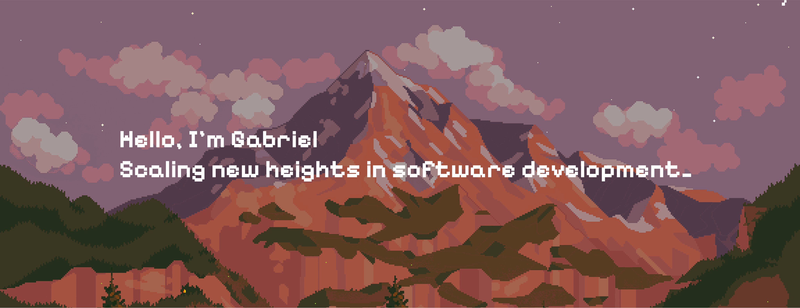

 

### Hi There!
**I'm Gabriel, a BSc student in Artificial Intelligence & Data Analytics**

I’m pursuing a BSc in Artificial Intelligence & Data Analytics at the University of Trieste.
I’m passionate about the intersection of algorithms and software engineering. My interests range from building custom interpreters and designing database systems to exploring constraint solving and data-driven applications. I enjoy turning theoretical challenges into practical, efficient solutions.

 

### 📚 Projects

| Repository | Link | Description | Tech Stack |
| :--- | :--- | :--- | :--- |
| **TensorForth Interpreter** | [GitHub](https://github.com/rostbear/pap-tensorforth-interpreter) | A stack-based language interpreter with tensor manipulation capabilities. | `C`, `OpenMP` |
| **2D Renderer** | [GitHub](https://github.com/rostbear/pap-2d-renderer) | Custom 2D rendering engine with tilemaps and sprite management. | `Python`, `JSON` |
| **ZIP Solver** | [GitHub](https://github.com/rostbear/zip-solver) | Constraint solving application using Z3 theorem prover. | `Python`, `Pygame`, `Z3` |
| **Kartodromo DB** | [GitHub](https://github.com/rostbear/kartodromo-db) | A robust database management system for a karting track. | `Flask`, `MySQL` |

 

### 🛠 Technologies I Use

  

  
  
  

  
  
  
  
  

 

### 🌐 Socials

  
  

